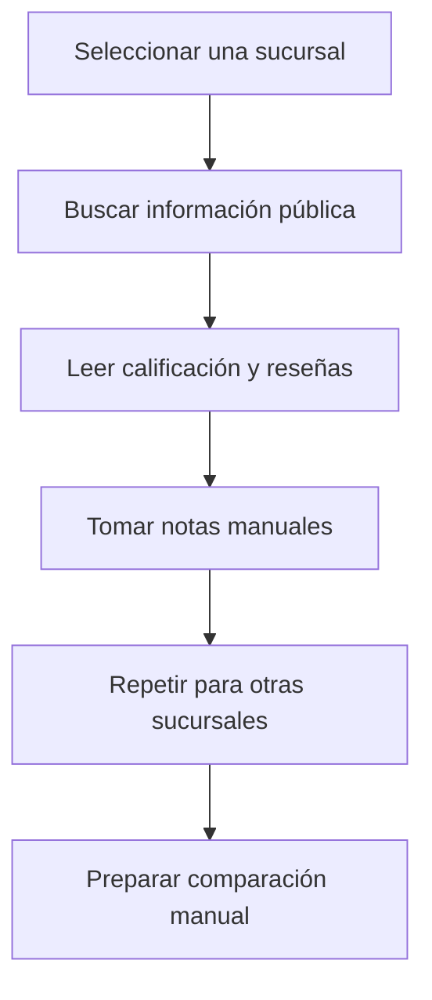
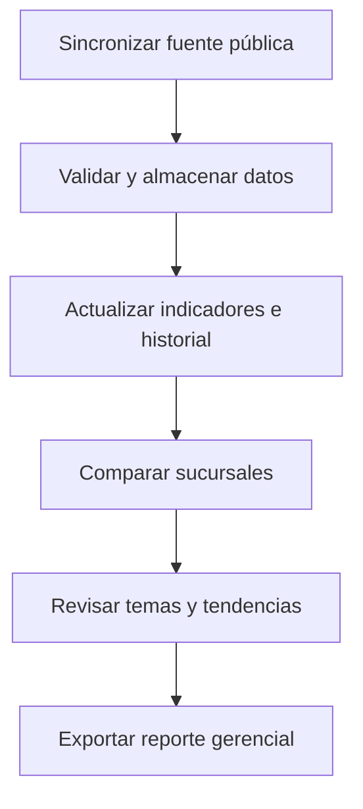

# Sucursal 360

## Problema y contexto de negocio

| Campo | Valor |
|---|---|
| Versión | 0.1 |
| Fecha | 12 de agosto de 2026 |
| Estado | Análisis inicial |
| Organización de ejemplo | Café Horizonte (ficticia) |

## 1. Contexto ficticio

Café Horizonte representa una cadena de cafeterías con cinco sucursales. Cada local aparece en plataformas públicas donde los clientes consultan dirección, horario, servicios, calificación y reseñas. La gerencia reconoce el valor de esa información, pero actualmente no dispone de una vista consolidada para analizar el desempeño de todos los locales.

El escenario no describe el proceso de una empresa real. Fue diseñado para demostrar cómo una necesidad gerencial puede convertirse en requisitos, integraciones, indicadores y reportes.

## 2. Situación actual conceptual

Para conocer la percepción de los clientes, un gerente tendría que buscar cada sucursal por separado, revisar manualmente sus indicadores y leer comentarios sin una estructura común. La información observada hoy puede cambiar mañana y, si no se conserva una instantánea autorizada, resulta difícil explicar la tendencia.

Al mismo tiempo, los datos operativos permanecen en sistemas internos como POS o ERP. En el demo no existe acceso a esos sistemas; por ello se representarán mediante un dataset ficticio que permita visualizar el potencial de una integración futura sin afirmar que existe una relación comprobada entre reputación y ventas.

## 3. Declaración del problema

La gerencia no cuenta con una herramienta única para comparar la reputación pública de las sucursales, identificar cambios en las calificaciones, organizar los temas presentes en las reseñas y preparar un reporte periódico para la toma de decisiones.

## 4. Efectos del problema

- Tiempo invertido en búsquedas y revisión manual.
- Comparaciones inconsistentes entre sucursales y períodos.
- Dificultad para detectar deterioros graduales.
- Comentarios relevantes que pueden pasar inadvertidos.
- Ausencia de un historial consolidado.
- Limitada capacidad para preparar reuniones de seguimiento con información uniforme.

## 5. Usuarios y necesidades

### 5.1 Gerente corporativo

Necesita una vista general, comparar sucursales, identificar tendencias, filtrar problemas recurrentes y obtener un reporte gerencial.

### 5.2 Gerente de sucursal

Necesita consultar el desempeño de su local y comprender las categorías que aparecen con mayor frecuencia en las reseñas.

### 5.3 Administrador del sistema

Necesita mantener las sucursales y sus identificadores externos, ejecutar sincronizaciones y diagnosticar fallos sin revisar directamente la base de datos.

## 6. Proceso conceptual actual

## 7. Proceso conceptual propuesto

## 8. Preguntas de negocio

La primera versión debe ayudar a responder:

1. ¿Cuál es la calificación actual de cada sucursal?
2. ¿Cuántas reseñas respaldan esa calificación?
3. ¿Qué sucursales mejoraron o empeoraron frente a la medición anterior?
4. ¿Cuáles tienen mayor concentración de calificaciones bajas?
5. ¿Qué temas se repiten en las reseñas categorizadas?
6. ¿Cuándo se actualizó por última vez la información?
7. ¿La fuente externa estaba disponible y qué datos entregó?
8. ¿Cómo se vería la comparación si se agregaran indicadores operativos internos?

## 9. Hipótesis de valor

Si la gerencia dispone de una vista consolidada con historia, categorías y filtros, podrá detectar con mayor rapidez las sucursales y temas que merecen una revisión. El demo validará la utilidad de esa consolidación; no pretende demostrar que una reseña sea verdadera, que una categoría explique por sí sola el desempeño o que exista causalidad entre reputación y ventas.

## 10. Capacidades de negocio propuestas

| Capacidad | Descripción |
|---|---|
| Consolidar | Reunir información autorizada de varias sucursales |
| Comparar | Aplicar indicadores y períodos uniformes |
| Observar tendencias | Conservar instantáneas históricas |
| Organizar comentarios | Asignar categorías gerenciales |
| Informar | Preparar una vista y exportación para seguimiento |
| Controlar la integración | Conocer el origen, fecha y estado de los datos |

## 11. Casos de uso de negocio

### CU-N01 - Revisión corporativa periódica

El gerente corporativo abre el panel, selecciona un período, compara las sucursales y examina aquellas con menor calificación o variación negativa.

### CU-N02 - Análisis de una sucursal

El gerente consulta el detalle de un local, revisa su historial, filtra reseñas de baja calificación y observa las categorías asignadas.

### CU-N03 - Preparación de reunión gerencial

El gerente configura los filtros y exporta un reporte con indicadores, tendencias y temas principales.

### CU-N04 - Diagnóstico de actualización

El administrador ejecuta la sincronización, verifica el resultado y consulta el mensaje registrado si una sucursal no pudo actualizarse.

## 12. Indicadores simulados como visión futura

Ventas netas, transacciones y ticket promedio aparecerán únicamente para ilustrar la futura incorporación de información del POS o ERP. En esta fase:

- no son fuente para decisiones reales;
- no se presentan como integración terminada;
- no generan alertas ni acciones automáticas;
- no se utilizan para afirmar relaciones causales;
- se identifican visualmente como **Datos simulados**.

## 13. Límites del análisis

- Las plataformas públicas pueden entregar solo una selección de reseñas.
- La calificación pertenece a la fuente externa y no es calculada por Sucursal 360.
- La categorización inicial será manual.
- Una reseña puede pertenecer a más de una categoría.
- La aplicación apoya la observación gerencial; no reemplaza investigación, contacto con clientes ni procesos de calidad.

## 14. Términos principales

| Término | Definición de negocio |
|---|---|
| Sucursal | Local incluido en la comparación gerencial |
| Fuente pública | Proveedor externo autorizado que entrega información de establecimientos |
| Calificación | Valor agregado publicado por la fuente externa |
| Reseña | Comentario o valoración individual que el proveedor permita consultar |
| Instantánea | Copia fechada de indicadores autorizados recibidos en una sincronización |
| Categoría | Tema gerencial asignado a una reseña |
| Tendencia | Cambio entre instantáneas comparables |
| Dato simulado | Información ficticia incluida para representar una integración futura |

