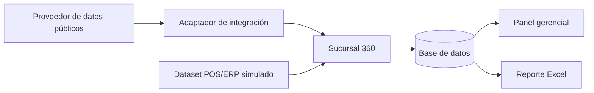

# Sucursal 360

## Integraciones, datos, KPI y reportes

| Campo | Valor |
|---|---|
| Versión | 0.1 |
| Fecha | 12 de agosto de 2026 |
| Estado | Especificación funcional inicial |

## 1. Propósito

Definir qué información necesita Sucursal 360, de dónde proviene, cómo se controla su sincronización y cómo se convierte en indicadores y reportes comprensibles para la gerencia.

## 2. Vista conceptual de fuentes



## 3. Fuentes de información

| Fuente | Tipo | Estado | Propósito |
|---|---|---|---|
| Proveedor de establecimientos y reseñas | Externa | Pendiente de selección | Datos públicos de sucursales |
| Archivo o datos semilla POS/ERP | Interna simulada | Confirmada para el demo | Mostrar ventas, transacciones y ticket promedio |
| Base de datos de Sucursal 360 | Interna | Confirmada | Historial, categorías, usuarios y bitácora |

## 4. Integración pública

### 4.1 Proveedor candidato

Google Places API u otro proveedor autorizado con cobertura adecuada es candidato inicial. La selección definitiva requiere una prueba técnica que confirme:

- acceso permitido para un proyecto demo;
- campos disponibles;
- cobertura geográfica;
- número y antigüedad de reseñas accesibles;
- posibilidad de almacenamiento y tiempo permitido de conservación;
- costos, cuotas y necesidad de facturación;
- atribuciones obligatorias;
- condiciones para mostrar contenido del proveedor.

No se utilizará scraping como sustituto de una API autorizada.

### 4.2 Operaciones requeridas

| Operación | Uso |
|---|---|
| Obtener detalle de establecimiento | Nombre público, dirección, coordenadas, horario y atributos disponibles |
| Obtener indicadores | Calificación y cantidad total de reseñas |
| Obtener reseñas disponibles | Texto, calificación, fecha y referencia permitida del autor |
| Registrar ejecución | Trazabilidad, diagnóstico y medición de disponibilidad |

### 4.3 Modelo canónico recibido

El adaptador traducirá la respuesta particular del proveedor a un modelo interno estable:

```text
ExternalBranchData
- Provider
- ExternalPlaceId
- DisplayName
- Address
- Latitude
- Longitude
- BusinessStatus
- OpeningHoursText[]
- Rating
- ReviewCount
- RetrievedAtUtc
- Reviews[]
```

```text
ExternalReviewData
- ExternalReviewId
- Rating
- Text
- PublishedAt
- AuthorDisplayName (solo si está permitido)
- Language
- SourceUrl (solo si está disponible y permitido)
```

### 4.4 Reglas de sincronización

1. La sincronización se inicia manualmente en la primera versión.
2. Las sucursales se procesan individualmente aunque la ejecución sea general.
3. Cada llamada utiliza un identificador de correlación.
4. La respuesta se valida antes de actualizar la base de datos.
5. Se crea una instantánea cuando existe un resultado válido y comparable.
6. Las reseñas se insertan o actualizan sin duplicar el contenido ya recibido.
7. Una falla conserva la última información válida.
8. El resultado final será `Exitoso`, `Parcial` o `Fallido`.
9. La interfaz mostrará la fecha del último éxito, no solamente del último intento.

### 4.5 Manejo de errores

| Situación | Comportamiento esperado |
|---|---|
| Tiempo de espera agotado | Registrar error; conservar datos; informar que no se actualizó |
| Límite de cuota | Detener llamadas innecesarias; registrar causa; permitir consulta histórica |
| Credencial inválida | Registrar sin mostrar el secreto; orientar al administrador |
| Sucursal no encontrada | Marcar configuración para revisión; no crear datos ficticios |
| Respuesta parcial | Actualizar únicamente campos válidos según las reglas definidas |
| Cambio de formato | Rechazar de forma controlada y conservar evidencia diagnóstica no sensible |

### 4.6 Bitácora de integración

```text
IntegrationRun
- Id
- CorrelationId
- Provider
- BranchId
- StartedAtUtc
- FinishedAtUtc
- Status
- HttpStatusCode
- RecordsReceived
- RecordsStored
- ErrorCode
- UserMessage
- TechnicalMessage
```

Los mensajes técnicos no se mostrarán directamente a usuarios gerenciales.

## 5. Fuente POS/ERP simulada

### 5.1 Objetivo

Representar la forma que podría tener una integración interna futura. El demo no afirmará que esta fuente corresponde a un sistema real.

### 5.2 Estructura propuesta

```csv
business_date,branch_code,net_sales,transaction_count,average_ticket,currency,data_origin
2026-07-01,SUC-001,42500.00,350,121.43,NIO,SIMULATED
```

### 5.3 Validaciones

- Fecha válida y dentro del período de demostración.
- Código de sucursal existente.
- Moneda permitida.
- Ventas y transacciones no negativas.
- Ticket promedio consistente con la fórmula, dentro de una tolerancia definida.
- Combinación fecha-sucursal única.
- `data_origin` debe ser `SIMULATED` en esta versión.

### 5.4 Sustitución futura

La fuente simulada podrá reemplazarse por:

- API REST del POS/ERP;
- consulta a una vista de base de datos de solo lectura;
- archivo programado depositado en una ubicación segura;
- proceso ETL corporativo.

La elección dependerá de seguridad, propiedad de datos, volumen, frecuencia y capacidades del sistema real.

## 6. Entidades principales

| Entidad | Propósito | Campos clave de negocio |
|---|---|---|
| Branch | Identificar la sucursal | código, nombre, estado, proveedor, identificador externo |
| BranchSnapshot | Conservar historia pública | fecha, calificación, cantidad de reseñas, estado comercial |
| Review | Conservar reseñas autorizadas | referencia externa, calificación, texto, fecha, sucursal |
| ReviewCategory | Definir temas gerenciales | código, nombre, estado |
| ReviewCategoryAssignment | Relacionar reseñas y temas | reseña, categoría, usuario, fecha |
| SimulatedOperationalMetric | Representar datos futuros | fecha, sucursal, ventas, transacciones, ticket promedio |
| IntegrationRun | Controlar sincronizaciones | proveedor, estado, tiempos, cantidades, error |
| ApplicationUser | Controlar acceso | usuario, rol, sucursal asignada, estado |

## 7. Catálogo de categorías

| Código | Categoría | Guía de uso |
|---|---|---|
| SERVICIO | Servicio | Atención, cortesía, conocimiento o actitud del personal |
| ESPERA | Tiempo de espera | Filas, demora en ordenar, preparación o entrega |
| CALIDAD | Calidad del producto | Sabor, temperatura, presentación o consistencia |
| LIMPIEZA | Limpieza | Mesas, baños, utensilios o percepción de higiene |
| PRECIO | Precio | Valor percibido, promociones o relación precio-calidad |
| INSTALACIONES | Instalaciones | Ambiente, espacio, estacionamiento, comodidad o ruido |
| OTROS | Otros | Tema relevante que no corresponde a las categorías anteriores |

La categorización será manual. No se interpretará automáticamente el sentimiento del texto en la primera versión.

## 8. Catálogo de KPI

| ID | Indicador | Definición o fórmula | Fuente | Observación |
|---|---|---|---|---|
| KPI-01 | Calificación actual | Última calificación válida entregada por el proveedor | Pública | Mostrar escala del proveedor |
| KPI-02 | Total de reseñas | Último conteo total válido del proveedor | Pública | Puede superar las reseñas detalladas accesibles |
| KPI-03 | Variación de calificación | Calificación actual - calificación de la instantánea comparable anterior | Calculada | No equivale a causalidad |
| KPI-04 | Nuevas reseñas estimadas | Conteo actual - conteo anterior, mínimo cero | Calculada | Es variación de conteo, no lista garantizada |
| KPI-05 | Reseñas de baja calificación disponibles | Cantidad de reseñas recuperadas con calificación definida como baja | Pública almacenada | El umbral será configurable; valor inicial propuesto: 1 o 2 |
| KPI-06 | Reseñas por categoría | Conteo de asignaciones por categoría y filtros | Interna | Una reseña puede contar en varias categorías |
| KPI-07 | Antigüedad del dato | Fecha actual - fecha del último éxito | Integración | Ayuda a identificar datos desactualizados |
| KPI-08 | Ventas netas | Suma de ventas netas simuladas | Simulada | Etiquetar siempre |
| KPI-09 | Transacciones | Suma de transacciones simuladas | Simulada | Etiquetar siempre |
| KPI-10 | Ticket promedio | Ventas netas simuladas / transacciones simuladas | Simulada/calculada | Sin valor si transacciones = 0 |

## 9. Reportes y vistas

### 9.1 Panel corporativo

- Tarjeta por sucursal.
- Calificación, reseñas, variación y última actualización.
- Indicador de dato actualizado o desactualizado.
- Orden por calificación, variación o cantidad de reseñas.
- Indicadores operativos simulados en una sección diferenciada.

### 9.2 Detalle de sucursal

- Datos generales y horario.
- Historial de calificación y reseñas.
- Reseñas disponibles.
- Filtros y categorías.
- Información de la última sincronización.

### 9.3 Análisis de reseñas

- Distribución por calificación.
- Conteo por categoría.
- Lista filtrable.
- Comparación por período y sucursal.

### 9.4 Reporte gerencial Excel

El archivo contendrá:

1. portada o resumen con fecha de generación, período y filtros;
2. comparación de sucursales;
3. tendencias por sucursal;
4. conteo de categorías;
5. indicadores operativos con marca **Datos simulados**;
6. fuentes, fecha de corte y notas metodológicas.

## 10. Calidad y trazabilidad de datos

- Todo indicador debe conservar `Source`, `RetrievedAt` y `LastSuccessfulSyncAt`.
- La zona horaria de visualización será configurable; la persistencia técnica utilizará UTC.
- Valores faltantes se mostrarán como **No disponible**, no como cero.
- La aplicación no completará reseñas o calificaciones ausentes con valores inventados.
- Las correcciones manuales no sustituirán silenciosamente datos externos.
- Los datos simulados utilizarán una procedencia explícita.
- Cada exportación incluirá notas sobre cobertura y limitaciones.

## 11. Prueba técnica requerida antes del diseño final

La integración solo se considerará viable después de ejecutar un spike que documente:

- autenticación y configuración;
- establecimiento de prueba;
- campos realmente recibidos;
- cobertura de reseñas;
- restricciones de almacenamiento y presentación;
- costo estimado para el volumen del demo;
- respuesta ante errores y límites;
- alternativa de mock controlado para desarrollo y pruebas automatizadas.

