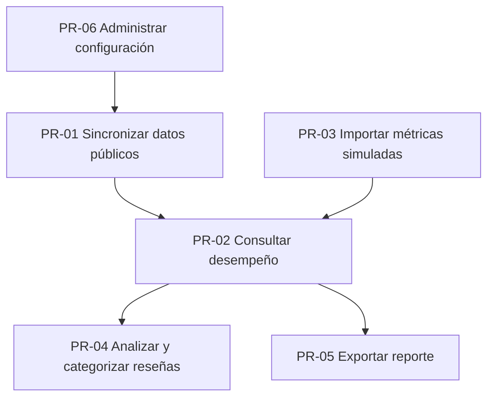
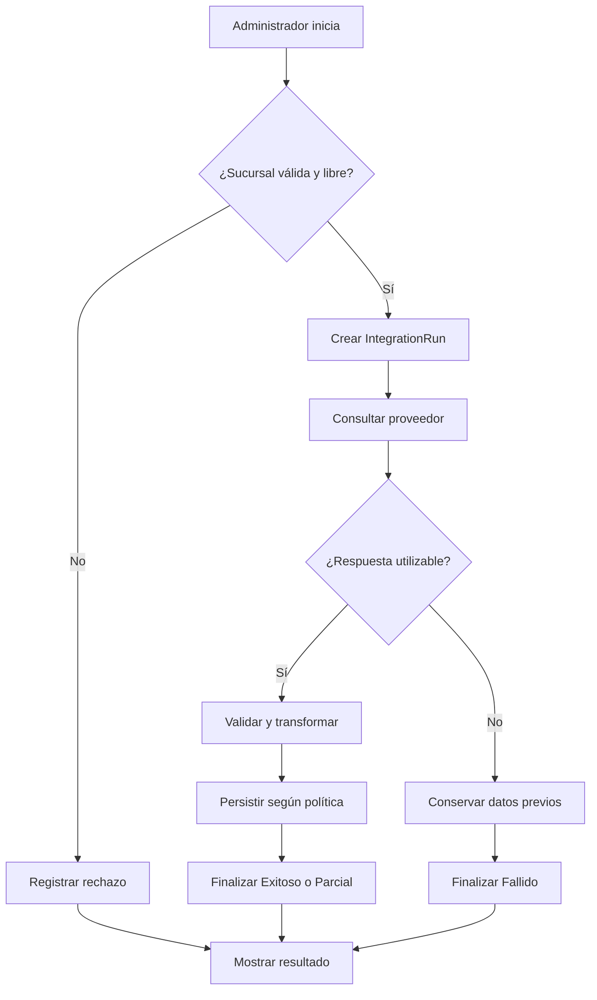
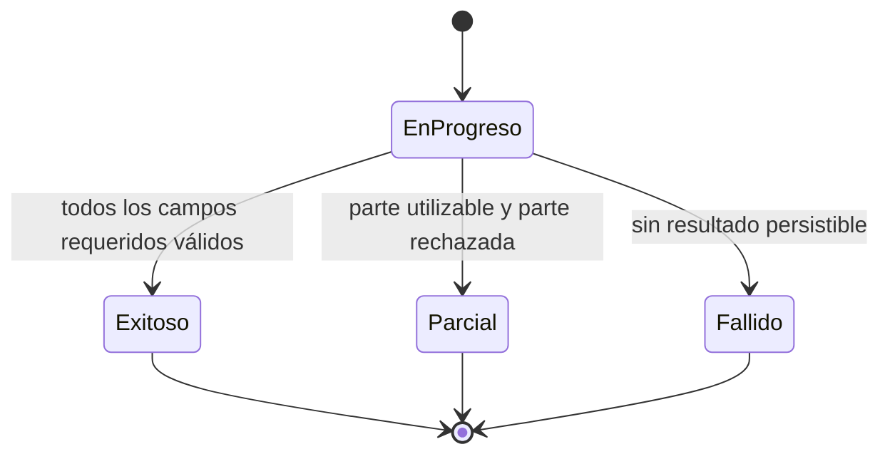

# Sucursal 360

## Procesos y casos de uso

| Campo | Valor |
|---|---|
| Versión | 1.0 |
| Fecha | 12 de agosto de 2026 |
| Estado | Línea base funcional de diseño |
| Notación | BPMN nivel 1 conceptual + especificación textual |

## 1. Propósito

Definir los flujos que la aplicación debe soportar y convertir los requisitos RF-01 a RF-25 en casos de uso implementables y verificables. Los diagramas son conceptuales; las tablas de pasos, reglas y resultados son el contrato vinculante para desarrollo.

## 2. Mapa de procesos



| ID | Proceso | Actor principal | Disparador | Resultado |
|---|---|---|---|---|
| PR-01 | Sincronizar datos públicos | Administrador | Acción manual individual o general | Datos válidos actualizados y ejecución registrada. |
| PR-02 | Consultar desempeño | Gerente | Apertura del panel o detalle | Comparación autorizada con fuente y corte. |
| PR-03 | Importar métricas simuladas | Administrador | Carga de CSV demo | Métricas válidas persistidas y errores reportados. |
| PR-04 | Analizar y categorizar reseñas | Gerente | Selección de filtros o categoría | Lista y conteos actualizados con auditoría manual. |
| PR-05 | Exportar reporte | Gerente corporativo | Solicitud de exportación | Archivo Excel coherente con filtros. |
| PR-06 | Administrar configuración | Administrador | Alta/cambio de sucursal o usuario | Configuración validada y disponible. |

## 3. Proceso PR-01 — Sincronización pública

### 3.1 Flujo conceptual por carriles



### 3.2 Reglas del proceso

1. La autorización se valida antes de crear una llamada externa.
2. Una sucursal inactiva o sin proveedor/identificador válido no se sincroniza.
3. Solo una ejecución de la misma sucursal puede estar `EnProgreso`.
4. La ejecución general crea una ejecución independiente por sucursal.
5. La persistencia depende de las capacidades del proveedor: `DEMO` permite histórico; `GOOGLE_PLACES_LIVE` es efímero por defecto.
6. Una respuesta parcial actualiza solo campos válidos y conserva valores previos.
7. Un error nunca elimina el último dato válido.
8. El usuario recibe un mensaje seguro y un ID de correlación.

### 3.3 Estado de `IntegrationRun`



No existe transición desde un estado final. Una repetición crea otra ejecución.

## 4. Casos de uso

### CU-01 — Iniciar sesión

| Campo | Especificación |
|---|---|
| Actor | Cualquier usuario activo |
| Requisitos | RF-01, RF-02 |
| Precondición | Cuenta semilla o creada por Administrador |
| Entrada | Correo y contraseña |
| Flujo principal | Validar credenciales; crear cookie; redirigir al panel autorizado. |
| Alternos | Credencial inválida: mensaje genérico. Cuenta bloqueada/inactiva: negar acceso. |
| Poscondición | Sesión autenticada sin exponer motivo sensible del fallo. |
| Prueba mínima | Login válido, inválido, bloqueo y logout. |

### CU-02 — Mantener una sucursal

| Campo | Especificación |
|---|---|
| Actor | Administrador |
| Requisitos | RF-04, RF-05 |
| Entrada | Código, nombre, estado, proveedor, identificador externo |
| Flujo principal | Crear o editar; validar unicidad; guardar; mostrar confirmación. |
| Alternos | Código duplicado o combinación proveedor/ID duplicada: rechazar sin cambios parciales. |
| Poscondición | Sucursal consistente y auditable. |
| Regla | Inactivar no elimina históricos ni asignaciones. |

### CU-03 — Sincronizar una sucursal

| Campo | Especificación |
|---|---|
| Actor | Administrador |
| Requisitos | RF-07, RF-09 a RF-11 |
| Entrada | `branchId` |
| Flujo principal | Validar; bloquear concurrencia; crear ejecución; consultar; transformar; persistir; finalizar; mostrar resumen. |
| Alternos | `INT-409-RUNNING`, `INT-404-PLACE`, `INT-429-QUOTA`, `INT-503-PROVIDER`, `INT-422-PAYLOAD`. |
| Salida | Estado, cantidades, último éxito, correlación. |
| Poscondición | Datos anteriores preservados en cualquier fallo. |

### CU-04 — Sincronizar todas las sucursales

| Campo | Especificación |
|---|---|
| Actor | Administrador |
| Requisitos | RF-08 a RF-11 |
| Entrada | Confirmación explícita |
| Flujo principal | Enumerar sucursales activas; ejecutar CU-03 secuencialmente; continuar ante fallos individuales; mostrar resumen. |
| Salida | Total, exitosas, parciales, fallidas y enlace a bitácora. |
| Regla | No usar paralelismo en V1 para simplificar cuota y diagnóstico. |

### CU-05 — Consultar panel corporativo

| Campo | Especificación |
|---|---|
| Actores | Gerente corporativo, Administrador |
| Requisitos | RF-12, RF-13, RF-15 |
| Entrada | Estado, calificación mínima, antigüedad, orden |
| Flujo principal | Aplicar alcance; obtener último snapshot por sucursal; calcular variaciones; renderizar tarjetas/tabla. |
| Alternos | Sin datos: `No disponible`; dato antiguo: advertencia; sin sucursales: estado vacío. |
| Salida | Comparación con fuente y fecha de corte. |

### CU-06 — Consultar detalle e historial

| Campo | Especificación |
|---|---|
| Actores | Gerentes autorizados, Administrador |
| Requisitos | RF-06, RF-14, RF-15 |
| Entrada | `branchId`, rango de fechas |
| Flujo principal | Verificar alcance; cargar sucursal; snapshots; métricas simuladas; última ejecución; renderizar secciones separadas. |
| Alternos | Sucursal fuera de alcance: 403; inexistente: 404; sin histórico: estado vacío. |

### CU-07 — Filtrar y categorizar reseñas

| Campo | Especificación |
|---|---|
| Actores | Gerentes autorizados, Administrador |
| Requisitos | RF-16 a RF-19 |
| Entrada | Sucursal, período, calificación, categoría; `reviewId` y categorías seleccionadas |
| Flujo principal | Verificar alcance; filtrar; mostrar conteos; reemplazar asignaciones manuales en una transacción; registrar usuario y fecha. |
| Alternos | Reseña no persistible del modo en vivo: clasificación deshabilitada con explicación. |
| Regla | Cero o varias categorías; nunca modificar el texto. |

### CU-08 — Importar métricas POS/ERP simuladas

| Campo | Especificación |
|---|---|
| Actor | Administrador |
| Requisitos | RF-20 a RF-22 |
| Entrada | CSV UTF-8 de máximo 2 MB |
| Flujo principal | Validar encabezados y filas; presentar vista previa; confirmar; guardar filas válidas en transacción. |
| Alternos | Si existe cualquier fila inválida, no persistir ninguna; entregar errores con número de fila. |
| Poscondición | Importación atómica e identificada como `SIMULATED`. |

### CU-09 — Exportar reporte gerencial

| Campo | Especificación |
|---|---|
| Actores | Gerente corporativo, Administrador |
| Requisitos | RF-23 a RF-25 |
| Entrada | Fecha inicial/final, sucursales, categorías |
| Flujo principal | Validar período; aplicar alcance; consultar una fotografía consistente; generar `.xlsx`; descargar. |
| Alternos | Sin datos: generar archivo con notas y secciones vacías, no inventar ceros. |
| Salida | `Sucursal360_Reporte_yyyyMMdd_HHmm.xlsx` |
| Regla | Incluir fuente, corte, zona horaria y etiqueta `Datos simulados`. |

### CU-10 — Consultar bitácora de integración

| Campo | Especificación |
|---|---|
| Actor | Administrador |
| Requisitos | RN-08, RF-10 |
| Entrada | Sucursal, proveedor, estado, rango de fechas, correlación |
| Flujo principal | Filtrar ejecuciones; paginar; abrir detalle seguro. |
| Salida | Inicio, fin, estado, cantidades, código y mensaje sanitizado. |
| Regla | Nunca mostrar clave, encabezados secretos ni payload bruto. |

### CU-11 — Administrar usuario y alcance

| Campo | Especificación |
|---|---|
| Actor | Administrador |
| Requisitos | RF-02, RF-03 |
| Entrada | Usuario, rol, sucursal asignada, estado |
| Flujo principal | Validar combinación; guardar rol/asignación; aplicar en la próxima solicitud. |
| Regla | `GerenteSucursal` requiere una sucursal; otros roles no deben depender de una asignación. |

## 5. Matriz de autorización de casos de uso

| Caso | GerenteCorporativo | GerenteSucursal | Administrador |
|---|:---:|:---:|:---:|
| CU-01 | Sí | Sí | Sí |
| CU-02 | No | No | Sí |
| CU-03 / CU-04 | No | No | Sí |
| CU-05 | Sí | No | Sí |
| CU-06 | Todas | Asignada | Todas |
| CU-07 | Todas | Asignada | Todas |
| CU-08 | No | No | Sí |
| CU-09 | Sí | No | Sí |
| CU-10 / CU-11 | No | No | Sí |

## 6. Mensajes funcionales normalizados

| Código | Mensaje para usuario | HTTP sugerido |
|---|---|---:|
| APP-403-SCOPE | No tiene permiso para consultar esta sucursal. | 403 |
| APP-404-BRANCH | La sucursal solicitada no existe. | 404 |
| INT-409-RUNNING | Ya existe una sincronización en curso para esta sucursal. | 409 |
| INT-404-PLACE | El proveedor no encontró el establecimiento configurado. | 422 |
| INT-429-QUOTA | El proveedor rechazó temporalmente la consulta por límite de uso. | 503 |
| INT-503-PROVIDER | No fue posible consultar el proveedor. Los datos anteriores siguen disponibles. | 503 |
| INT-422-PAYLOAD | La respuesta no contiene datos válidos suficientes. | 422 |
| CSV-400-HEADER | El archivo no contiene las columnas requeridas. | 400 |
| CSV-422-ROW | Una o más filas contienen valores inválidos. | 422 |
| RPT-400-PERIOD | El período solicitado no es válido. | 400 |

El detalle técnico se guarda con el mismo código y un `CorrelationId`, pero no se devuelve al navegador.

## 7. Trazabilidad

| Requisitos | Casos de uso |
|---|---|
| RF-01 a RF-03 | CU-01, CU-11 |
| RF-04 a RF-06 | CU-02, CU-06 |
| RF-07 a RF-11 | CU-03, CU-04, CU-10 |
| RF-12 a RF-15 | CU-05, CU-06 |
| RF-16 a RF-19 | CU-07 |
| RF-20 a RF-22 | CU-08 |
| RF-23 a RF-25 | CU-09 |

## 8. Contrato para agentes de programación

```yaml
document_id: DOC-08
use_cases:
  mandatory: [CU-01, CU-02, CU-03, CU-04, CU-05, CU-06, CU-07, CU-08, CU-09, CU-10, CU-11]
transaction_boundaries:
  CU-03: one_branch_sync
  CU-07: replace_review_assignments
  CU-08: whole_csv_import
authorization_rule: server_side_scope_check_on_every_branch_resource
invariants:
  - FINAL_INTEGRATION_RUN_STATUS_IS_IMMUTABLE
  - SYNC_FAILURE_NEVER_DELETES_LAST_VALID_DATA
  - BATCH_SYNC_CONTINUES_AFTER_INDIVIDUAL_FAILURE
  - CSV_IMPORT_IS_ATOMIC
  - NO_VALUE_IS_RENDERED_AS_NO_DISPONIBLE_NOT_ZERO
```

## 9. Referencias internas

- [Requisitos de negocio y del sistema](04-requisitos-negocio.md)
- [Diseño de experiencia y pantallas](09-diseno-experiencia-wireframes.md)
- [Diseño de integraciones y contratos](13-diseno-integraciones-contratos.md)
- [Diseño de seguridad y acceso](14-diseno-seguridad-acceso.md)

