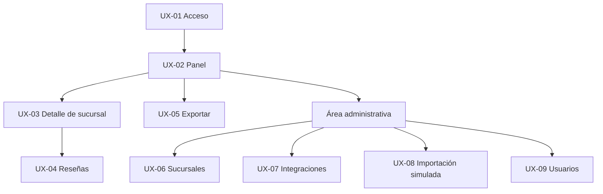

# Sucursal 360

## Diseño de experiencia y especificación de pantallas

| Campo | Valor |
|---|---|
| Versión | 1.0 |
| Fecha | 12 de agosto de 2026 |
| Estado | Línea base UX de baja fidelidad |
| Objetivo | Interfaz gerencial de escritorio, adaptable a móvil |

## 1. Principios de experiencia

1. La primera pantalla responde: qué sucursal requiere atención, con qué dato y de qué fecha.
2. Datos públicos, datos sintéticos y cálculos se distinguen visual y textualmente.
3. `No disponible` representa ausencia; nunca se muestra cero como sustituto.
4. Toda métrica visible incluye fuente o una forma inmediata de consultarla.
5. Una falla de sincronización no bloquea la consulta del último dato válido.
6. Acciones administrativas se mantienen fuera del recorrido gerencial.
7. Color nunca es el único medio para comunicar estado.

## 2. Arquitectura de información



## 3. Rutas vinculantes

| ID | Pantalla | Ruta GET principal | Acciones POST | Roles |
|---|---|---|---|---|
| UX-01 | Iniciar sesión | `/Identity/Account/Login` | Identity | Anónimo |
| UX-02 | Panel corporativo | `/dashboard` | Ninguna | GerenteCorporativo, Administrador |
| UX-03 | Detalle de sucursal | `/branches/{id}` | Ninguna | Autorizados para la sucursal |
| UX-04 | Reseñas | `/reviews` | `/reviews/{id}/categories` | Gerentes autorizados, Administrador |
| UX-05 | Exportación | `/reports/management` | `/reports/management/export` | GerenteCorporativo, Administrador |
| UX-06 | Sucursales | `/admin/branches` | `/admin/branches/*` | Administrador |
| UX-07 | Integraciones | `/admin/integrations` | `/admin/integrations/sync/*` | Administrador |
| UX-08 | Importación simulada | `/admin/simulated-data/import` | preview, confirm | Administrador |
| UX-09 | Usuarios | `/admin/users` | `/admin/users/*` | Administrador |

La ruta `/` redirige según rol: corporativo/administrador a `/dashboard`; gerente de sucursal a `/branches/{assignedBranchId}`.

## 4. Plantilla común

| Región | Contenido | Reglas |
|---|---|---|
| Encabezado | Marca `Sucursal 360`, ambiente `DEMO`, usuario y cerrar sesión | `DEMO` siempre visible; logout por POST. |
| Navegación | Panel, Reseñas, Reportes; Administración según rol | Ocultar no reemplaza autorización del servidor. |
| Título | Nombre de pantalla y contexto | Un solo `h1`. |
| Estado del dato | Fuente, último éxito, último intento y alerta | Cerca de los indicadores, no solo en pie. |
| Contenido | Tarjetas, tabla o formulario | Orden de lectura lógico y teclado. |
| Pie | Independencia del demo, versión y enlaces legales | Google legal solo si proveedor habilitado. |

## 5. UX-01 — Acceso

### Componentes

| Orden | Componente | Contenido/acción |
|---:|---|---|
| 1 | Aviso | `Demostración independiente con datos ficticios.` |
| 2 | Campo correo | Obligatorio, formato correo, autocomplete username. |
| 3 | Campo contraseña | Obligatorio, autocomplete current-password. |
| 4 | Botón | `Iniciar sesión`. |
| 5 | Error | Mensaje genérico; no revelar si el correo existe. |

No se ofrece autorregistro, recuperación de contraseña por correo ni proveedores sociales en V1.

## 6. UX-02 — Panel corporativo

### Objetivo

Comparar las cinco sucursales autorizadas en menos de un minuto.

### Regiones y contenido

| Orden | Región | Contenido |
|---:|---|---|
| 1 | Barra de filtros | Estado, calificación mínima, antigüedad máxima, orden; botones Aplicar y Limpiar. |
| 2 | Resumen | Sucursales visibles, calificación promedio solo si se etiqueta como cálculo interno, sucursales desactualizadas. |
| 3 | Comparación | Tabla como componente principal; tarjetas opcionales en pantallas estrechas. |
| 4 | Datos simulados | Resumen operativo separado con banda `Datos simulados`. |
| 5 | Acciones | Ver detalle; Exportar reporte. Sin botón de sincronización para gerentes. |

### Columnas de comparación

| Campo | Presentación | Ordenable |
|---|---|:---:|
| Sucursal | Nombre y código | Sí |
| Calificación | Valor/5 o `No disponible` | Sí |
| Total de reseñas | Entero o `No disponible` | Sí |
| Variación | Signo, valor y período comparable | Sí |
| Último éxito | Fecha local y antigüedad textual | Sí |
| Estado | `Actualizado`, `Desactualizado` o `Sin datos` | Sí |
| Acción | `Ver detalle` | No |

`Desactualizado` significa que el último éxito supera 7 días; este valor es configuración de presentación, no una regla de calidad externa.

### Estados

- **Cargando:** skeleton de tabla, sin métricas falsas.
- **Vacío:** “No hay sucursales activas dentro de su alcance.”
- **Datos parciales:** banner ámbar y valores faltantes individuales.
- **Proveedor fallido:** mostrar último éxito y “El último intento falló”; no cubrir la pantalla con un error fatal.

## 7. UX-03 — Detalle de sucursal

| Pestaña/sección | Contenido | Fuente |
|---|---|---|
| Resumen | Nombre, dirección, estado, horario, calificación, conteo | Pública demo o vista en vivo |
| Tendencia | Gráfica y tabla de snapshots por fecha | Histórica demo |
| Operación simulada | Ventas, transacciones, ticket, tendencia mensual | `SIMULATED` |
| Integración | Último éxito, último intento, proveedor y estado | Interna |
| Acciones | Ver reseñas; volver | Según autorización |

La gráfica nunca es la única representación: debajo incluye una tabla con fecha, calificación y conteo. Las series públicas y simuladas no comparten eje ni panel.

## 8. UX-04 — Reseñas y categorización

### Filtros

Sucursal, fecha inicial, fecha final, calificación 1–5, categoría y `Sin categoría`.

### Lista

Cada fila muestra calificación, texto, fecha publicada, fuente y categorías manuales. Autor solo aparece si el proveedor permite mostrarlo. Para fixtures usar `Cliente demo NN`.

### Edición de categorías

- Control multiselección de categorías activas.
- Texto: `Clasificación manual`.
- Acción `Guardar categorías` por reseña.
- Confirmación no modal y anuncio accesible.
- Auditoría visible bajo demanda: usuario y fecha de última modificación.
- En modo Google en vivo la acción aparece deshabilitada: `La reseña en vivo no se almacena y no puede clasificarse en este demo.`

### Conteos

Mostrar barras o tabla por categoría. Incluir la nota: “Una reseña puede pertenecer a más de una categoría; los conteos no son porcentajes exclusivos.”

## 9. UX-05 — Reporte gerencial

| Campo | Tipo | Regla |
|---|---|---|
| Desde | Fecha | Obligatoria |
| Hasta | Fecha | Obligatoria y `>= Desde` |
| Sucursales | Multiselección | Al menos una autorizada |
| Categorías | Multiselección | Opcional |
| Incluir datos simulados | Checkbox | Marcado por defecto; la etiqueta siempre se conserva |

Mostrar una previsualización resumida de filtros. El botón `Exportar Excel` inicia una descarga; al fallar, conserva los filtros y muestra un código de correlación.

## 10. UX-06 — Administración de sucursales

Tabla con código, nombre, estado, proveedor, identificador externo y último éxito. Formulario crear/editar con validación por campo. `Inactivar` requiere confirmación; no se ofrece eliminar. El identificador externo se oculta parcialmente en la tabla si su formato puede ser sensible, aunque no es secreto.

## 11. UX-07 — Integraciones

### Resumen

- Botón `Sincronizar todas` con confirmación.
- Filtros de bitácora.
- Tabla paginada de ejecuciones.
- Estado con texto e icono: `En progreso`, `Exitoso`, `Parcial`, `Fallido`.
- Detalle: tiempos, proveedor, sucursal, recibidos, almacenados, código y correlación.

### Acción individual

`Sincronizar` se deshabilita mientras existe una ejecución activa. La UI no asume exclusión mutua: el servidor puede responder `INT-409-RUNNING`.

## 12. UX-08 — Importación simulada

Flujo de dos pasos:

1. **Seleccionar y validar:** archivo CSV, tamaño máximo, encabezados requeridos; resultado con filas válidas e inválidas.
2. **Confirmar importación:** solo disponible si no hay errores. Muestra período, sucursales y total de filas.

Los errores indican número de fila, campo, código y mensaje. El contenido se trata como datos sintéticos, pero aun así se escapa antes de mostrarlo.

## 13. UX-09 — Usuarios

Tabla de correo, rol, sucursal asignada y estado. Crear/editar permite exactamente un rol de aplicación. `GerenteSucursal` obliga a elegir sucursal. No se muestra contraseña; la creación utiliza una contraseña temporal definida por el administrador para el demo y fuerza un valor conforme a la política configurada. No se implementa envío por correo.

## 14. Sistema visual mínimo

| Token | Uso | Valor inicial |
|---|---|---|
| `--color-primary` | Acciones principales | Verde oscuro accesible |
| `--color-info` | Información | Azul |
| `--color-warning` | Parcial/desactualizado | Ámbar con texto oscuro |
| `--color-danger` | Fallido/validación | Rojo con texto e icono |
| `--color-simulated` | Banda de dato sintético | Morado con etiqueta textual |

No copiar identidad visual, logo ni paleta de Casa del Café, Café Soluble u otra organización real. Café Horizonte debe verse genérico y claramente ficticio.

## 15. Accesibilidad y adaptación

- HTML semántico, encabezados jerárquicos y `label` asociado.
- Foco visible y recorrido completo por teclado.
- Errores resumidos y vinculados a cada campo.
- Contraste WCAG AA como objetivo.
- Tablas con encabezados; gráficas con alternativa tabular.
- Estados comunicados con texto, icono y color.
- A 768 px o menos, filtros se apilan y la tabla puede transformarse en tarjetas sin perder campos.

## 16. Mapeo pantalla–caso de uso

| Pantalla | Casos de uso | Requisitos principales |
|---|---|---|
| UX-01 | CU-01 | RF-01, RF-02 |
| UX-02 | CU-05 | RF-12, RF-13, RF-15 |
| UX-03 | CU-06 | RF-06, RF-14, RF-15 |
| UX-04 | CU-07 | RF-16 a RF-19 |
| UX-05 | CU-09 | RF-23 a RF-25 |
| UX-06 | CU-02 | RF-04, RF-05 |
| UX-07 | CU-03, CU-04, CU-10 | RF-07 a RF-11 |
| UX-08 | CU-08 | RF-20 a RF-22 |
| UX-09 | CU-11 | RF-02, RF-03 |

## 17. Contrato para agentes de programación

```yaml
document_id: DOC-09
ui_framework: aspnet_core_mvc_razor
required_routes:
  - /dashboard
  - /branches/{id}
  - /reviews
  - /reports/management
  - /admin/branches
  - /admin/integrations
  - /admin/simulated-data/import
  - /admin/users
rendering_rules:
  missing_value: No disponible
  simulated_badge: Datos simulados
  manual_category_badge: Clasificación manual
  live_provider_badge: Datos en vivo
forbidden_ui:
  - alerts_or_task_creation
  - automatic_sentiment_labels
  - pos_transaction_screens
  - delete_branch_action
  - client_side_only_authorization
acceptance:
  - every_chart_has_tabular_equivalent
  - every_metric_exposes_source_and_cutoff
  - failed_sync_does_not_block_historical_views
```

## 18. Referencias internas

- [Procesos y casos de uso](08-procesos-casos-uso.md)
- [Modelo de dominio](10-modelo-dominio-diccionario.md)
- [Diseño de seguridad y acceso](14-diseno-seguridad-acceso.md)

