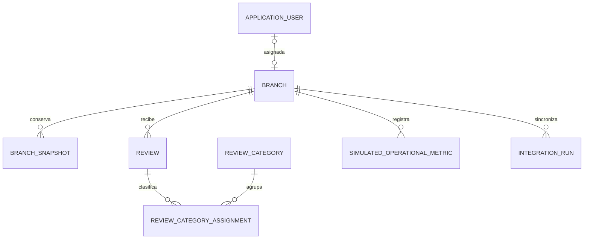

# Sucursal 360

## Modelo de dominio y diccionario de datos

| Campo | Valor |
|---|---|
| Versión | 1.0 |
| Fecha | 12 de agosto de 2026 |
| Estado | Línea base de diseño |
| Alcance | Modelo suficiente para el demo; no modelo empresarial |

## 1. Propósito

Definir los conceptos, relaciones, estados y reglas que debe implementar Sucursal 360. Los nombres técnicos en inglés son vinculantes para C#, base de datos y contratos; las etiquetas de pantalla permanecen en español.

## 2. Límites del dominio

El modelo cubre sucursales, snapshots sintéticos, reseñas sintéticas, clasificación manual, métricas POS/ERP simuladas, ejecuciones de integración y usuarios. No modela órdenes, productos, mesas, inventario, pagos, facturas, clientes, tareas ni alertas.

## 3. Vista conceptual



## 4. Entidades y objetos principales

| ID | Tipo C# | Responsabilidad | Persistencia |
|---|---|---|---|
| DOM-01 | `Branch` | Identidad y configuración de una sucursal ficticia | Sí |
| DOM-02 | `BranchSnapshot` | Punto histórico de datos públicos sintéticos | Sí |
| DOM-03 | `Review` | Reseña sintética recuperada del proveedor demo | Sí |
| DOM-04 | `ReviewCategory` | Categoría gerencial administrada por seed | Sí |
| DOM-05 | `ReviewCategoryAssignment` | Clasificación manual actual | Sí |
| DOM-06 | `ReviewCategoryAudit` | Historial simple de asignar/quitar categorías | Sí |
| DOM-07 | `SimulatedOperationalMetric` | Ventas y transacciones ficticias por día | Sí |
| DOM-08 | `SimulatedDataImport` | Resultado de una importación CSV confirmada | Sí |
| DOM-09 | `IntegrationRun` | Trazabilidad de una sincronización por sucursal | Sí |
| DOM-10 | `ApplicationUser` | Usuario Identity, rol y alcance | Sí |
| DOM-11 | `ExternalBranchData` | Respuesta canónica de cualquier proveedor | No, DTO |
| DOM-12 | `ExternalReviewData` | Reseña canónica de proveedor | No, DTO |
| DOM-13 | `ManagementReportRequest` | Filtros de exportación | No, DTO |

## 5. Diccionario por entidad

### DOM-01 — Branch

| Propiedad C# | Tipo | Requerido | Regla |
|---|---|:---:|---|
| `Id` | `Guid` | Sí | Generado por aplicación. |
| `Code` | `string(20)` | Sí | Mayúsculas; único; formato `SUC-###`. |
| `Name` | `string(120)` | Sí | Nombre ficticio visible. |
| `IsActive` | `bool` | Sí | Inactivar no elimina datos. |
| `Provider` | `PublicDataProvider` | Sí | `Demo` o `GooglePlaces`. |
| `ExternalPlaceId` | `string(200)?` | Condicional | Obligatorio para sincronizar; único con proveedor. |
| `CreatedAtUtc` | `DateTimeOffset` | Sí | UTC, inmutable. |
| `UpdatedAtUtc` | `DateTimeOffset` | Sí | UTC. |

`Branch` no persiste dirección ni horario como valores editables. Esos valores pertenecen al snapshot demo o a la consulta en vivo.

### DOM-02 — BranchSnapshot

| Propiedad | Tipo | Regla |
|---|---|---|
| `Id` | `Guid` | Identidad. |
| `BranchId` | `Guid` | Sucursal existente. |
| `Provider` | `PublicDataProvider` | En V1 persistida debe ser `Demo`. |
| `DisplayName` | `string(160)?` | Valor recibido, no sustituye `Branch.Name`. |
| `Address` | `string(300)?` | Ficticia en modo demo. |
| `Latitude` / `Longitude` | `decimal?` | Rangos geográficos válidos. |
| `BusinessStatus` | `BusinessStatus?` | `Operational`, `TemporarilyClosed`, `PermanentlyClosed`, `Unknown`. |
| `OpeningHoursJson` | `string?` | Array JSON de textos; solo presentación. |
| `Rating` | `decimal(2,1)?` | 1.0–5.0 o `null`; no recalculada. |
| `ReviewCount` | `int?` | `>= 0` o `null`. |
| `RetrievedAtUtc` | `DateTimeOffset` | Fecha declarada por el fixture/consulta. |
| `IntegrationRunId` | `Guid` | Ejecución exitosa/parcial que lo produjo. |

Un snapshot es inmutable. Se permite como máximo uno por sucursal, proveedor y `RetrievedAtUtc`.

### DOM-03 — Review

| Propiedad | Tipo | Regla |
|---|---|---|
| `Id` | `Guid` | Identidad interna. |
| `BranchId` | `Guid` | Sucursal autorizable. |
| `Provider` | `PublicDataProvider` | Persistida debe ser `Demo` en V1. |
| `ExternalReviewId` | `string(200)` | Único con proveedor. |
| `Rating` | `byte?` | 1–5 o `null`. |
| `Text` | `string(4000)?` | Nunca modificado por clasificación. |
| `PublishedAtUtc` | `DateTimeOffset?` | Fecha del fixture. |
| `AuthorDisplayName` | `string(120)?` | En fixtures usa seudónimo demo. |
| `Language` | `string(10)?` | BCP-47 cuando exista. |
| `SourceUrl` | `string(1000)?` | URL absoluta permitida o `null`. |
| `RetrievedAtUtc` | `DateTimeOffset` | UTC. |

### DOM-04 — ReviewCategory

| Propiedad | Tipo | Regla |
|---|---|---|
| `Id` | `Guid` | Determinista en datos semilla. |
| `Code` | `string(30)` | Único: `SERVICIO`, `ESPERA`, `CALIDAD`, `LIMPIEZA`, `PRECIO`, `INSTALACIONES`, `OTROS`. |
| `Name` | `string(80)` | Etiqueta española. |
| `Description` | `string(300)` | Guía de uso. |
| `IsActive` | `bool` | Categorías inactivas no se asignan. |

No se incluye UI para crear categorías en V1; se administran como datos semilla versionados.

### DOM-05 — ReviewCategoryAssignment

| Propiedad | Tipo | Regla |
|---|---|---|
| `ReviewId` | `Guid` | Parte de PK compuesta. |
| `ReviewCategoryId` | `Guid` | Parte de PK compuesta. |
| `AssignedByUserId` | `string` | Usuario autenticado. |
| `AssignedAtUtc` | `DateTimeOffset` | UTC. |

Al guardar, el conjunto enviado reemplaza el conjunto actual en una transacción.

### DOM-06 — ReviewCategoryAudit

| Propiedad | Tipo | Regla |
|---|---|---|
| `Id` | `Guid` | Identidad. |
| `ReviewId` | `Guid` | Reseña. |
| `ReviewCategoryId` | `Guid` | Categoría. |
| `Action` | `CategoryAuditAction` | `Assigned` o `Removed`. |
| `ChangedByUserId` | `string` | Usuario autenticado. |
| `ChangedAtUtc` | `DateTimeOffset` | UTC. |

### DOM-07 — SimulatedOperationalMetric

| Propiedad | Tipo | Regla |
|---|---|---|
| `Id` | `Guid` | Identidad. |
| `BranchId` | `Guid` | Sucursal existente. |
| `BusinessDate` | `DateOnly` | Fecha del negocio. |
| `NetSales` | `decimal(18,2)` | `>= 0`. |
| `TransactionCount` | `int` | `>= 0`. |
| `Currency` | `string(3)` | Inicialmente `NIO`. |
| `DataOrigin` | `DataOrigin` | Debe ser `Simulated`. |
| `ImportId` | `Guid` | Lote confirmado. |

`AverageTicket` no se persiste. Se calcula como `NetSales / TransactionCount`; si el conteo es cero, devuelve `null`.

### DOM-08 — SimulatedDataImport

| Propiedad | Tipo | Regla |
|---|---|---|
| `Id` | `Guid` | Identidad. |
| `FileName` | `string(255)` | Solo nombre sanitizado, no ruta. |
| `RowCount` | `int` | Filas guardadas. |
| `PeriodStart` / `PeriodEnd` | `DateOnly` | Rango importado. |
| `ImportedByUserId` | `string` | Administrador. |
| `ImportedAtUtc` | `DateTimeOffset` | UTC. |

Solo se crea al confirmar un archivo completamente válido.

### DOM-09 — IntegrationRun

| Propiedad | Tipo | Regla |
|---|---|---|
| `Id` | `Guid` | Identidad. |
| `CorrelationId` | `string(64)` | Único. |
| `Provider` | `PublicDataProvider` | Proveedor invocado. |
| `BranchId` | `Guid` | Sucursal. |
| `StartedAtUtc` / `FinishedAtUtc` | `DateTimeOffset` / nullable | Orden temporal válido. |
| `Status` | `IntegrationRunStatus` | `InProgress`, `Successful`, `Partial`, `Failed`. |
| `HttpStatusCode` | `int?` | Si hubo HTTP. |
| `RecordsReceived` / `RecordsStored` | `int` | `>= 0`. |
| `ErrorCode` | `string(50)?` | Catálogo de DOC-08/DOC-13. |
| `UserMessage` | `string(500)?` | Seguro para UI. |
| `TechnicalMessage` | `string(2000)?` | Sanitizado; sin secreto/payload completo. |
| `TriggeredByUserId` | `string` | Administrador. |

### DOM-10 — ApplicationUser

Extiende `IdentityUser`:

| Propiedad | Tipo | Regla |
|---|---|---|
| `IsActive` | `bool` | Inactivo no inicia sesión. |
| `AssignedBranchId` | `Guid?` | Obligatorio únicamente para `GerenteSucursal`. |
| `CreatedAtUtc` | `DateTimeOffset` | UTC. |

En V1 cada usuario tiene exactamente un rol de aplicación.

## 6. Enumeraciones canónicas

```csharp
public enum PublicDataProvider { Demo = 1, GooglePlaces = 2 }
public enum IntegrationRunStatus { InProgress = 1, Successful = 2, Partial = 3, Failed = 4 }
public enum BusinessStatus { Unknown = 0, Operational = 1, TemporarilyClosed = 2, PermanentlyClosed = 3 }
public enum CategoryAuditAction { Assigned = 1, Removed = 2 }
public enum DataOrigin { Simulated = 1 }
```

Persistir enumeraciones como enteros. Convertir a etiquetas españolas en la UI; no usar textos localizados como claves.

## 7. Servicios de dominio/aplicación

| Interfaz | Entrada | Salida | Regla central |
|---|---|---|---|
| `IPublicBranchDataProvider` | Identificador externo, cancelación | `ExternalBranchData` | Aísla proveedor. |
| `IBranchSynchronizationService` | Sucursal y usuario | `SynchronizationResult` | Orquesta ejecución y política de persistencia. |
| `IReviewCategorizationService` | Reseña, categorías y usuario | Resultado | Reemplazo atómico y auditoría. |
| `ISimulatedDataImportService` | CSV | Vista previa/resultado | Importación atómica. |
| `IManagementReportExporter` | `ManagementReportRequest` | bytes y MIME | Excel. |
| `IBranchAccessService` | Usuario y sucursal | booleano/política | Alcance servidor. |

No crear repositorios genéricos. Los servicios usan `ApplicationDbContext` con consultas explícitas y comprobables.

## 8. Invariantes globales

| ID | Invariante |
|---|---|
| INV-01 | Un gerente de sucursal nunca consulta o modifica datos de otra sucursal. |
| INV-02 | Una falla de integración no elimina snapshots ni reseñas anteriores. |
| INV-03 | Contenido Google no se persiste salvo decisión documentada posterior. |
| INV-04 | Todo dato operativo persistido tiene origen `Simulated`. |
| INV-05 | Ausencia es `null`, no cero ni cadena vacía inventada. |
| INV-06 | Snapshots y bitácoras finales son inmutables. |
| INV-07 | La clasificación manual no modifica el texto de la reseña. |
| INV-08 | Fechas técnicas se persisten en UTC; `BusinessDate` no lleva zona horaria. |

## 9. Contrato para agentes de programación

```yaml
document_id: DOC-10
aggregate_roots: [Branch, Review, SimulatedDataImport, IntegrationRun, ApplicationUser]
derived_fields:
  AverageTicket: NetSales / TransactionCount; null when TransactionCount == 0
persisted_provider_content:
  DEMO: [BranchSnapshot, Review]
  GOOGLE_PLACES: []
identity_roles: [GerenteCorporativo, GerenteSucursal, Administrador]
exactly_one_role_per_user: true
forbidden_entities: [Order, Product, Table, Inventory, Payment, Invoice, Customer, Alert, Task]
implementation_note: use_explicit_services_and_ef_queries_not_generic_repository
```

## 10. Referencias internas

- [Requisitos de negocio y del sistema](04-requisitos-negocio.md)
- [Procesos y casos de uso](08-procesos-casos-uso.md)
- [Modelo de datos y DBML](11-modelo-datos-dbml.md)
- [Arquitectura de la solución](12-arquitectura-solucion.md)

