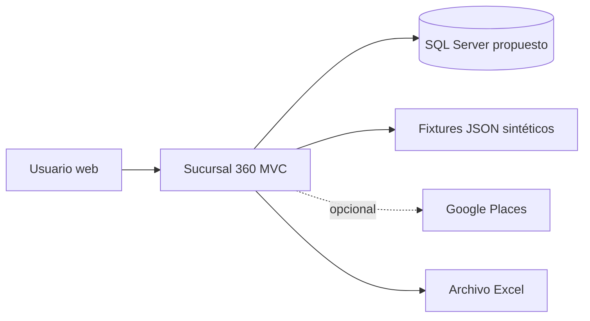
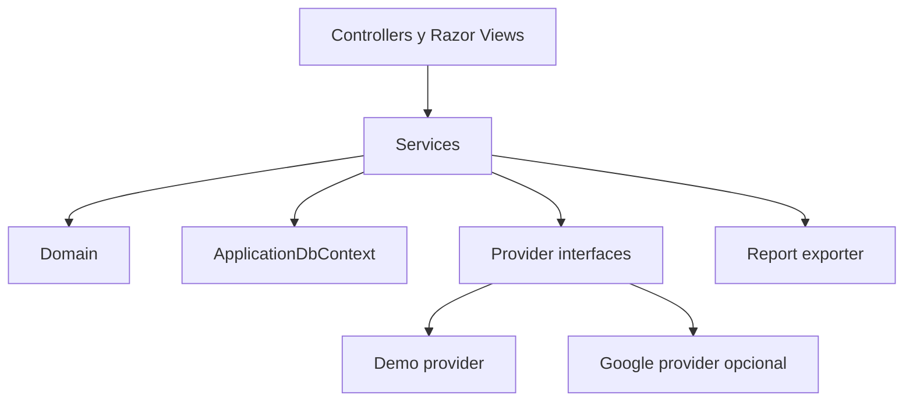
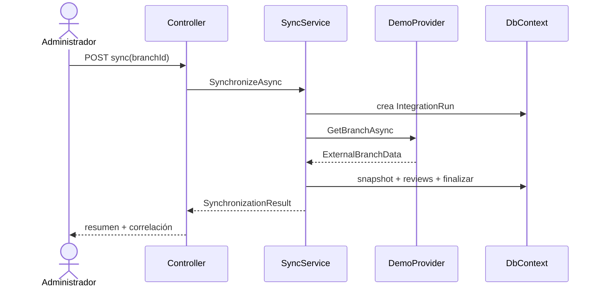

# Sucursal 360

## Arquitectura de la solución

| Campo | Valor |
|---|---|
| Versión | 1.0 |
| Fecha | 12 de agosto de 2026 |
| Estado | Línea base de arquitectura para demo |
| Estilo | Monolito MVC organizado por responsabilidades |

## 1. Resultado

Sucursal 360 será una aplicación ASP.NET Core MVC en .NET 10 y un proyecto MSTest. Se evita una arquitectura empresarial de múltiples proyectos porque no aporta valor proporcional al demo. La separación necesaria para demostrar integración, reportes y pruebas se logra con carpetas, servicios concretos e interfaces solamente en los límites externos.

## 2. Contexto



Google Places no participa en el recorrido obligatorio. El futuro POS/ERP está representado por CSV y no aparece como sistema real.

## 3. Contenedores

| Contenedor | Tecnología | Responsabilidad |
|---|---|---|
| `Sucursal360.Web` | ASP.NET Core MVC | UI Razor, casos de uso, dominio pequeño, EF Core, integraciones y Excel. |
| `Sucursal360.Tests` | MSTest | Pruebas unitarias y de integración web. |
| Base de datos | SQL Server Developer/Express propuesto | Persistencia relacional e Identity. |
| Fixtures | JSON versionado | Datos externos sintéticos reproducibles. |

No se crean API separada, frontend SPA, servicio de sincronización, cola, cache distribuida ni microservicios.

## 4. Estructura vinculante del repositorio

```text
Sucursal360/
├── Sucursal360.sln
├── global.json
├── README.md
├── docs/
│   └── 01-...15-...
├── src/
│   └── Sucursal360.Web/
│       ├── Controllers/
│       ├── Data/
│       │   ├── ApplicationDbContext.cs
│       │   ├── Configurations/
│       │   ├── Migrations/
│       │   └── Seed/
│       ├── Domain/
│       │   ├── Entities/
│       │   └── Enums/
│       ├── Integrations/
│       │   ├── Abstractions/
│       │   ├── Demo/
│       │   │   └── Fixtures/
│       │   └── GooglePlaces/
│       ├── Reporting/
│       ├── Security/
│       ├── Services/
│       ├── ViewModels/
│       ├── Views/
│       ├── wwwroot/
│       ├── Program.cs
│       └── Sucursal360.Web.csproj
└── tests/
    └── Sucursal360.Tests/
        ├── Unit/
        ├── Integration/
        ├── Fixtures/
        └── Sucursal360.Tests.csproj
```

No crear carpetas vacías “por arquitectura”. Cada carpeta aparece cuando contiene una pieza del alcance.

## 5. Dependencias internas



Reglas:

- Los controladores coordinan HTTP, validan `ModelState`, llaman servicios y seleccionan vistas. No contienen consultas grandes ni reglas de negocio.
- Los servicios expresan casos de uso y aplican alcance/autorización de recurso.
- Las entidades no dependen de MVC, Google, ClosedXML ni tipos de vista.
- Los proveedores transforman su formato al DTO canónico.
- Los ViewModels son específicos de pantalla; no exponer entidades EF directamente a formularios.
- No introducir MediatR, AutoMapper, CQRS ni repositorio genérico en V1.

## 6. Componentes principales

| ID | Componente | Clases esperadas | Casos de uso |
|---|---|---|---|
| ARC-01 | Acceso | Identity UI, `UserAdministrationService`, `BranchAccessService` | CU-01, CU-11 |
| ARC-02 | Sucursales | `BranchesController`, `BranchService` | CU-02, CU-06 |
| ARC-03 | Sincronización | `IntegrationsController`, `BranchSynchronizationService` | CU-03, CU-04, CU-10 |
| ARC-04 | Proveedor demo | `DemoPublicBranchDataProvider`, validator | CU-03 |
| ARC-05 | Proveedor Google | `GooglePlacesClient`, mapper | Recorrido opcional |
| ARC-06 | Panel | `DashboardController`, `DashboardQueryService` | CU-05 |
| ARC-07 | Reseñas | `ReviewsController`, `ReviewCategorizationService` | CU-07 |
| ARC-08 | Importación | `SimulatedDataController`, `CsvSimulatedDataImportService` | CU-08 |
| ARC-09 | Reporte | `ReportsController`, `ClosedXmlManagementReportExporter` | CU-09 |

## 7. Flujo de una sincronización demo



En Google vivo, el servicio devuelve un modelo de vista efímero y finaliza la ejecución sin snapshot/reseñas persistentes.

## 8. Configuración de dependencias

`Program.cs` registra dependencias de forma explícita:

```csharp
builder.Services.AddControllersWithViews();
builder.Services.AddRazorPages(); // UI de Identity
builder.Services.AddDbContext<ApplicationDbContext>(options =>
    options.UseSqlServer(connectionString));

builder.Services
    .AddDefaultIdentity<ApplicationUser>(options => { /* DOC-14 */ })
    .AddRoles<IdentityRole>()
    .AddEntityFrameworkStores<ApplicationDbContext>();

builder.Services.AddScoped<IBranchSynchronizationService, BranchSynchronizationService>();
builder.Services.AddScoped<IBranchAccessService, BranchAccessService>();
builder.Services.AddScoped<IManagementReportExporter, ClosedXmlManagementReportExporter>();

// Registrar exactamente un proveedor según PublicData:Provider.
```

El fragmento es guía, no archivo completo. Los nombres de configuración y seguridad se rigen por DOC-07 y DOC-14.

## 9. Paquetes propuestos

| Paquete | Origen | Obligatorio | Razón |
|---|---|:---:|---|
| `Microsoft.EntityFrameworkCore.SqlServer` | Microsoft | Si SQL Server | Proveedor EF. |
| `Microsoft.EntityFrameworkCore.Tools` | Microsoft | Sí desarrollo | Migraciones. |
| `Microsoft.AspNetCore.Identity.EntityFrameworkCore` | Microsoft | Sí | Identity persistente. |
| `Microsoft.Extensions.Http.Resilience` | Microsoft | Solo Google | Resiliencia HTTP. |
| `Microsoft.AspNetCore.Mvc.Testing` | Microsoft | Sí pruebas integración | Host de prueba. |
| `MSTest` / adaptador | Microsoft | Sí | Marco de pruebas. |
| `ClosedXML` | Externo .NET | Sí reporte | Excel simple. |
| `CsvHelper` | Externo .NET | Opcional | Usar solo si reduce claramente validación CSV; `TextFieldParser`/parser pequeño es alternativa. |
| Chart.js | Externo JS | Sí para gráfica | Visualización web ligera. |

Antes de agregar cualquier otro paquete, registrar qué código evita y por qué la BCL/.NET no basta. No incorporar paquetes de validación, mapping, logging o mediator en V1.

## 10. Ejecución local

Configuración objetivo:

1. SDK .NET 10.
2. SQL Server LocalDB/Express en Windows o SQL Server Developer en contenedor.
3. `dotnet user-secrets` para conexión y clave opcional.
4. `dotnet ef database update`.
5. `dotnet run --project src/Sucursal360.Web`.

El README debe incluir también un recorrido sin Google y explicar cómo regenerar datos demo. Docker Compose es opcional, no entregable obligatorio.

## 11. Despliegue

### Opción recomendada para el demo

| Recurso | Plan | Uso |
|---|---|---|
| Azure App Service | F1 Free | Hospedar `Sucursal360.Web`; 1 GB y cuota diaria de CPU compartida. |
| Azure SQL Database | Free offer, General Purpose serverless | Base del demo; 100,000 vCore-segundos y 32 GB mensuales según la oferta vigente. |

App Service F1 y Azure SQL Free no tienen SLA y son adecuados para aprendizaje, prueba de concepto y portafolio, no para operación empresarial. En Azure SQL se debe seleccionar **Auto-pause the database until next month** al alcanzar la cuota; no seleccionar continuación facturable. Crear también un presupuesto/alerta de costo cero o mínimo.

Referencias vigentes al 12 de agosto de 2026: [App Service F1](https://azure.microsoft.com/en-us/pricing/details/app-service/windows/) y [Azure SQL Database Free](https://learn.microsoft.com/en-us/azure/azure-sql/database/free-offer?view=azuresql).

### Alternativa

Azure Container Apps Consumption incluye una cuota mensual gratuita y puede escalar a cero, pero requiere contenedor y configuración adicional. Solo se usará si desplegar un contenedor forma parte explícita del aprendizaje; no es necesario para completar el demo. [Precios oficiales](https://azure.microsoft.com/en-us/pricing/details/container-apps/).

No se diseñan alta disponibilidad, balanceo, escalado horizontal, recuperación ante desastres ni observabilidad distribuida. La ejecución local continúa siendo obligatoria para que el proyecto no dependa de una cuenta Azure.

## 12. Decisiones de arquitectura

| ADR | Decisión | Alternativa descartada | Motivo |
|---|---|---|---|
| ADR-001 | MVC con Razor | SPA/Blazor | Menor superficie y demuestra fundamentos ASP.NET Core. |
| ADR-002 | Un proyecto de aplicación | Clean Architecture de 4+ proyectos | Proporcional al demo. |
| ADR-003 | EF Core y SQL Server propuesto | PostgreSQL/SQLite | Ecosistema Microsoft y SQL visible; SQLite sigue como alternativa previa a migración. |
| ADR-004 | Proveedor demo obligatorio | Dependencia obligatoria de Google | Reproducibilidad y términos. |
| ADR-005 | ClosedXML tras interfaz | Open XML SDK | Mucho menos código para una sola exportación. |
| ADR-006 | MSTest | xUnit/NUnit | Preferencia por herramientas Microsoft; cualquiera sería técnicamente válido. |
| ADR-007 | App Service F1 + Azure SQL Free | Container Apps u otra nube | Menos piezas y recorrido Microsoft coherente con el demo. |

## 13. Contrato para agentes de programación

```yaml
document_id: DOC-12
solution_projects:
  production: [Sucursal360.Web]
  tests: [Sucursal360.Tests]
architecture_style: simple_mvc_monolith
allowed_abstractions:
  - IPublicBranchDataProvider
  - IBranchSynchronizationService
  - IBranchAccessService
  - IReviewCategorizationService
  - ISimulatedDataImportService
  - IManagementReportExporter
forbidden_patterns_v1:
  - microservices
  - cqrs
  - mediator
  - generic_repository
  - automapper
  - message_bus
  - distributed_cache
  - separate_spa
package_rule: prefer_microsoft_or_bcl; exceptions_must_reduce_demo_code
```

## 14. Referencias internas

- [Investigación técnica](07-investigacion-tecnica-integracion.md)
- [Modelo de dominio](10-modelo-dominio-diccionario.md)
- [Modelo de datos](11-modelo-datos-dbml.md)
- [Diseño de integraciones](13-diseno-integraciones-contratos.md)
- [Diseño de seguridad](14-diseno-seguridad-acceso.md)
- [Plan de implementación](15-plan-implementacion-ia.md)
