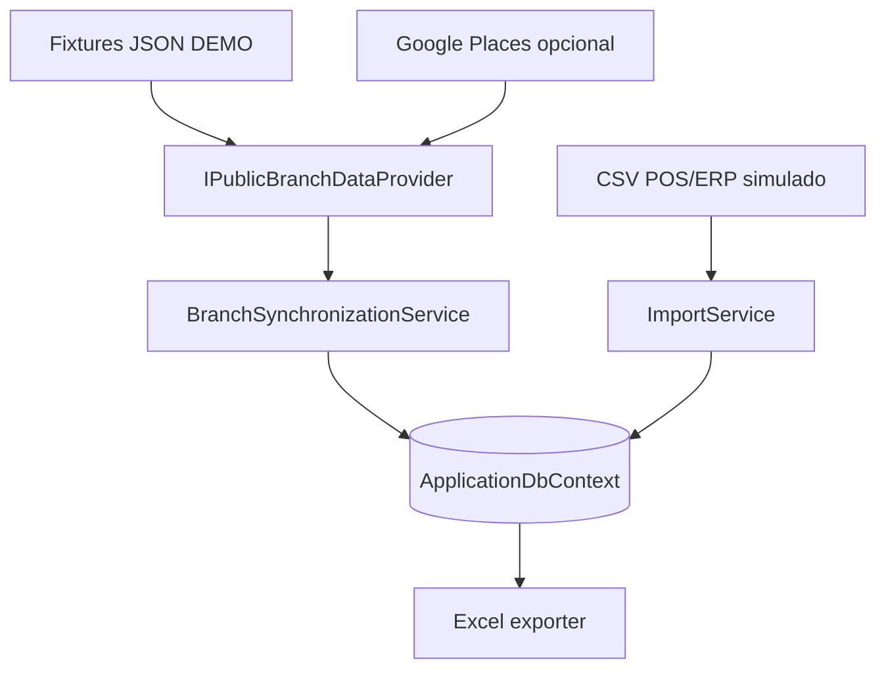

# Sucursal 360

## Diseño de integraciones y contratos

| Campo | Valor |
|---|---|
| Versión | 1.0 |
| Fecha | 12 de agosto de 2026 |
| Estado | Contrato técnico para implementación |
| Integraciones V1 | JSON demo, Google Places opcional, CSV simulado, Excel |

## 1. Principio

La integración visible es parte central del demo, pero debe ser pequeña y reproducible. Existe un contrato canónico y dos implementaciones de entrada: fixtures sintéticos obligatorios y Google Places en vivo opcional. El CSV simula una entrada POS/ERP futura; Excel es la única salida.

## 2. Límites de integración



No hay webhooks, scraping, colas, trabajos programados, correo, CRM, tareas ni escritura hacia sistemas externos.

## 3. Contrato canónico público

### 3.1 Interfaz

```csharp
public interface IPublicBranchDataProvider
{
    PublicDataProvider Provider { get; }

    Task<ExternalBranchData> GetBranchAsync(
        string externalPlaceId,
        CancellationToken cancellationToken);
}
```

### 3.2 DTOs

```csharp
public sealed record ExternalBranchData(
    PublicDataProvider Provider,
    string ExternalPlaceId,
    string? DisplayName,
    string? Address,
    decimal? Latitude,
    decimal? Longitude,
    string? BusinessStatus,
    IReadOnlyList<string> OpeningHoursText,
    decimal? Rating,
    int? ReviewCount,
    DateTimeOffset RetrievedAtUtc,
    IReadOnlyList<ExternalReviewData> Reviews,
    string? SourceUrl,
    IReadOnlyList<ExternalAttribution> Attributions);

public sealed record ExternalReviewData(
    string ExternalReviewId,
    byte? Rating,
    string? Text,
    DateTimeOffset? PublishedAtUtc,
    string? AuthorDisplayName,
    string? Language,
    string? SourceUrl,
    IReadOnlyList<ExternalAttribution> Attributions);

public sealed record ExternalAttribution(
    string ProviderName,
    string? DisplayText,
    string? Uri);
```

DTOs son inmutables y no llevan atributos de EF Core ni tipos del SDK de un proveedor.

### 3.3 Validación canónica

| Código | Condición | Resultado |
|---|---|---|
| VAL-EXT-001 | Proveedor o ID vacío | Rechazar respuesta. |
| VAL-EXT-002 | ID recibido distinto del solicitado | Rechazar respuesta. |
| VAL-EXT-003 | Calificación fuera de 1–5 | Convertir a `null`, marcar parcial. |
| VAL-EXT-004 | Conteo negativo | Convertir a `null`, marcar parcial. |
| VAL-EXT-005 | Coordenada fuera de rango | Convertir par a `null`, marcar parcial. |
| VAL-EXT-006 | Fecha futura > 5 minutos | Usar reloj actual como recuperación y marcar parcial. |
| VAL-EXT-007 | Reseña sin ID | Ignorar reseña y marcar parcial. |
| VAL-EXT-008 | Reseñas duplicadas por ID | Conservar primera válida y marcar parcial. |

El proveedor entrega datos; `BranchSynchronizationService` decide persistencia y estado.

## 4. Proveedor DEMO

### 4.1 Configuración

```json
{
  "PublicData": {
    "Provider": "Demo",
    "Demo": {
      "FixturesPath": "Integrations/Demo/Fixtures"
    }
  }
}
```

`DemoPublicBranchDataProvider` busca `{externalPlaceId}.json`, deserializa con `System.Text.Json`, valida `schemaVersion = 1.0` y mapea al DTO. No usa red.

### 4.2 Errores

| Excepción/caso interno | Código funcional |
|---|---|
| Fixture inexistente | `INT-404-PLACE` |
| JSON inválido | `INT-422-PAYLOAD` |
| Versión no soportada | `INT-422-SCHEMA` |
| ID no coincide | `INT-422-PAYLOAD` |

### 4.3 Escenarios obligatorios de fixture

| Archivo | Escenario |
|---|---|
| `DEMO-SUC-001.json` a `005.json` | Cinco sucursales válidas |
| Test fixture `valid-branch.json` | Respuesta completa |
| Test fixture `partial-branch.json` | Campos opcionales inválidos/faltantes |
| Test fixture `invalid-schema.json` | Error controlado |

## 5. Proveedor Google Places en vivo

### 5.1 Cliente

Usar cliente tipado con `HttpClient`; no agregar SDK externo.

```csharp
public sealed class GooglePlacesClient(HttpClient httpClient, IOptions<GooglePlacesOptions> options)
{
    public Task<GooglePlaceResponse> GetPlaceAsync(
        string placeId,
        CancellationToken cancellationToken);
}
```

### 5.2 Solicitud

```http
GET /v1/places/{placeId}
X-Goog-Api-Key: <secret>
X-Goog-FieldMask: id,displayName,formattedAddress,location,businessStatus,rating,userRatingCount,regularOpeningHours,googleMapsUri,reviews
Accept-Language: es-NI
```

La máscara se guarda como constante. Para un recorrido económico sin reseñas se define una máscara alternativa que termina en `googleMapsUri`. Nunca usar `*` fuera de una prueba local explícita.

### 5.3 Mapeo

| Google | Canónico |
|---|---|
| `id` | `ExternalPlaceId` |
| `displayName.text` | `DisplayName` |
| `formattedAddress` | `Address` |
| `location.latitude/longitude` | Coordenadas |
| `businessStatus` | `BusinessStatus` |
| `regularOpeningHours.weekdayDescriptions` | `OpeningHoursText` |
| `rating` | `Rating` |
| `userRatingCount` | `ReviewCount` |
| `googleMapsUri` | `SourceUrl` |
| `reviews[].name` o clave estable disponible | `ExternalReviewId` |
| `reviews[].rating` | Review `Rating` |
| `reviews[].text.text` | Review `Text` |
| `reviews[].publishTime` | `PublishedAtUtc` |
| autor/atribuciones disponibles | `ExternalAttribution` |

Verificar nombres exactos contra la versión vigente durante `SPIKE-INT-01`; si cambian, modificar solo DTO/mapeo Google y pruebas de contrato.

### 5.4 Política de uso

- El modo en vivo requiere páginas legales y atribución visible.
- La clave se envía solo como header y nunca aparece en logs.
- El resultado se usa para una vista temporal de demostración.
- V1 no persiste snapshot, dirección, horario, rating, conteo ni reseñas Google.
- Se permite persistir `placeId` y la bitácora técnica sin contenido de Places.
- Si la política vigente cambia, detener trabajo y actualizar DOC-07/DOC-13 antes de código.

Fuente: [Place Details (New)](https://developers.google.com/maps/documentation/places/web-service/place-details) y [políticas de Places](https://developers.google.com/maps/documentation/places/web-service/policies).

## 6. Orquestación de sincronización

```text
SynchronizeAsync(branchId, userId):
  1. validar Administrador y configuración de Branch
  2. rechazar si existe ejecución InProgress
  3. crear IntegrationRun(InProgress) y guardar
  4. llamar IPublicBranchDataProvider
  5. validar DTO canónico
  6. si Provider == Demo:
       insertar snapshot inmutable si no existe
       upsert de reseñas por (Provider, ExternalReviewId)
     si Provider == GooglePlaces:
       no persistir contenido; devolver modelo efímero
  7. finalizar Successful o Partial y guardar cantidades
  8. ante error conocido, finalizar Failed y conservar datos previos
  9. devolver resultado seguro con CorrelationId
```

Las escrituras de los pasos 6 y 7 usan una transacción. La creación inicial del run se guarda antes de llamar a la red para conservar diagnóstico.

## 7. Catálogo de errores de integración

| Código | Causa | Reintento | Mensaje UI |
|---|---|:---:|---|
| `INT-400-CONFIG` | Configuración incompleta | No | Revise la configuración de la sucursal. |
| `INT-401-CREDENTIAL` | Clave rechazada | No | La credencial del proveedor no es válida. |
| `INT-403-PROVIDER` | Proveedor prohíbe operación | No | El proveedor no autorizó la consulta. |
| `INT-404-PLACE` | Lugar/fixture no existe | No | No se encontró el establecimiento configurado. |
| `INT-409-RUNNING` | Ejecución simultánea | No | Ya existe una sincronización en curso. |
| `INT-422-SCHEMA` | Esquema no soportado | No | El formato recibido no es compatible. |
| `INT-422-PAYLOAD` | Datos sin mínimo válido | No | La respuesta no contiene datos utilizables. |
| `INT-429-QUOTA` | Límite de uso | Sí, respetando header | Se alcanzó temporalmente el límite del proveedor. |
| `INT-503-PROVIDER` | Red/5xx/timeout | Sí, máximo 2 | El proveedor no está disponible; los datos anteriores siguen visibles. |
| `INT-500-UNEXPECTED` | Error no clasificado | No automático | Ocurrió un error; use la correlación para diagnosticar. |

## 8. Contrato CSV POS/ERP simulado

### 8.1 Archivo

- UTF-8, coma como separador, encabezado obligatorio.
- Máximo 2 MB y 10,000 filas; para el demo se esperan menos de 500.
- Fechas ISO `yyyy-MM-dd`.
- Decimales con punto y sin separador de miles.

```csv
business_date,branch_code,net_sales,transaction_count,currency,data_origin
2026-07-01,SUC-001,42500.00,350,NIO,SIMULATED
```

`average_ticket` no se recibe ni persiste; el sistema lo calcula.

### 8.2 Códigos de validación

| Código | Campo/condición |
|---|---|
| `CSV-400-HEADER` | Columnas distintas al contrato |
| `CSV-413-SIZE` | Archivo supera límite |
| `CSV-422-DATE` | Fecha inválida |
| `CSV-422-BRANCH` | Código no existe |
| `CSV-422-SALES` | Venta no numérica o negativa |
| `CSV-422-TRANSACTIONS` | Conteo no entero o negativo |
| `CSV-422-CURRENCY` | Moneda distinta de `NIO` |
| `CSV-422-ORIGIN` | Origen distinto de `SIMULATED` |
| `CSV-422-DUPLICATE` | Duplicado de sucursal/fecha en archivo |

Si existe un error no se guarda ninguna fila. La vista previa puede conservarse en memoria/TempData protegida o revalidar el archivo en confirmación; no requiere almacenamiento temporal distribuido.

## 9. Contrato Excel

### 9.1 Interfaz

```csharp
public interface IManagementReportExporter
{
    Task<ExportedFile> ExportAsync(
        ManagementReportRequest request,
        ClaimsPrincipal user,
        CancellationToken cancellationToken);
}

public sealed record ExportedFile(
    byte[] Content,
    string ContentType,
    string FileName);
```

### 9.2 Libro

| Hoja | Contenido mínimo |
|---|---|
| `Resumen` | Generado, período, filtros, fuentes y advertencias |
| `Sucursales` | KPI actuales y variaciones |
| `Tendencias` | Una fila por snapshot |
| `Categorias` | Conteos por sucursal/categoría |
| `Operacion_Simulada` | Ventas, transacciones y ticket calculado; banda `DATOS SIMULADOS` |

El nombre será `Sucursal360_Reporte_yyyyMMdd_HHmm.xlsx`. Usar zona `America/Managua` para el nombre/visualización y UTC en consultas. No insertar macros, fórmulas externas, hipervínculos no validados ni contenido que comience con `=`, `+`, `-` o `@` desde texto de usuario sin neutralizarlo.

## 10. Pruebas de contrato

| ID | Prueba |
|---|---|
| CT-01 | Fixture válido se mapea completamente. |
| CT-02 | Fixture parcial produce `Partial` y conserva valores previos. |
| CT-03 | Fixture inválido finaliza `Failed` sin borrar. |
| CT-04 | Mapeo Google usa JSON grabado y sanitizado, sin llamar red. |
| CT-05 | `401`, `404`, `429`, `500` y timeout se traducen al código esperado. |
| CT-06 | Clave Google nunca aparece en log capturado. |
| CT-07 | CSV válido importa todo. |
| CT-08 | Una fila inválida importa cero. |
| CT-09 | Excel contiene cinco hojas, filtros y etiquetas requeridas. |
| CT-10 | Texto con prefijo de fórmula queda neutralizado en Excel. |

## 11. Contrato para agentes de programación

```yaml
document_id: DOC-13
inbound_integrations:
  - DEMO_JSON_REQUIRED
  - GOOGLE_PLACES_LIVE_OPTIONAL
  - SIMULATED_POS_CSV_REQUIRED
outbound_integrations:
  - MANAGEMENT_XLSX_REQUIRED
network_calls_in_tests: forbidden
google_sdk_package: forbidden
json_serializer: System.Text.Json
http_client: typed_HttpClient
csv_import: atomic
excel_worksheets: [Resumen, Sucursales, Tendencias, Categorias, Operacion_Simulada]
provider_persistence:
  Demo: snapshots_and_reviews
  GooglePlaces: integration_run_only
```

## 12. Referencias internas

- [Investigación técnica](07-investigacion-tecnica-integracion.md)
- [Procesos y casos de uso](08-procesos-casos-uso.md)
- [Modelo de dominio](10-modelo-dominio-diccionario.md)
- [Diseño de seguridad](14-diseno-seguridad-acceso.md)
